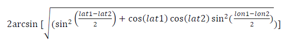

# Prediction of US Forest Fire Severity

Forest fire severity in the United States is a pervasive issue with a potential cost to businesses, individuals, and municipalities of billions of dollars each year. In 2020, CoreLogic estimates that the combined reconstruction cost value of homes at risk in the United States is over 638 billion dollars. Due to the recent availability of each geographically referenced forest fire in the US in [this dataset](https://www.kaggle.com/rtatman/188-million-us-wildfires), it is feasible to search for and uncover the variables that determine the severity of those fire observations. 

In this project, python code is used to demonstrate how large amounts of sparsely related data may be used to infer correlation between certain variables and forest fire size in acres. With recursive addition of new data and refinement, these variables along with others may even be used to predict forest fire severity with reasonable accuracy.  

In a practical sense, the techniques outlined below demonstrate how a data analysis process is used to gather and clean immense volumes of data from seemingly unrelated sources to test a predictive model.


``` python
#define station query
query = ('SELECT * FROM bigquery-public-data.noaa_gsod.stations')
#use google big query client to retreive data and create noaa_df dataframe
noaa_df = bqclient.query(query).result().to_dataframe()
noaa_df.to_csv('weatherdata/stations.csv', index = False)

#creates master dataframe with all weather data
for year in tqdm_notebook(range(1992, 2016)):
    query = "SELECT * FROM `bigquery-public-data.noaa_gsod.gsod{}`".format(year)
    df = bqclient.query(query).result().to_dataframe()
    filename = 'weatherdata/US_weather_{}.csv'.format(year)
    df.to_csv(filename, index = False)
```

[First Notebook: NOAA weather Gathering](https://github.com/Jeff-VA/Sample-Projects/blob/gh-pages/forest_fire_project/Step_1_NOAA_weather_data_gathering_notebook.ipynb)


``` python
#create dataframe by querying Fires table from *.sqlite database
connection = sqlite3.connect('fire_database.sqlite')
firedf = pd.read_sql_query('''SELECT FIRE_YEAR,
                                     DISCOVERY_DOY,
                                     FIRE_SIZE,
                                     LATITUDE,
                                     LONGITUDE,
                                     STAT_CAUSE_DESCR,
                                     STATE
                              FROM Fires''', connection)
```



``` python
#use Haversine Distance fromula to find distance from fires to stations
from math import radians, cos, sin, asin, sqrt
def dist(lat1, long1, lat2, long2):
    # convert decimal degrees to radians 
    lat1, long1, lat2, long2 = map(radians, [lat1, long1, lat2, long2])
    # haversine formula 
    dlon = long2 - long1 
    dlat = lat2 - lat1 
    a = sin(dlat/2)**2 + cos(lat1) * cos(lat2) * sin(dlon/2)**2
    c = 2 * asin(sqrt(a)) 
    # Radius of earth in kilometers is 6371
    km = 6371* c
    return km

#to match nearest stations to fires
def find_nearest(lat, long):
    distances = weatherwith_stations.apply(
        lambda row: dist(lat, long, row['lat'], row['lon']), 
        axis=1)
    return (weatherwith_stations.loc[distances.idxmin(), 'ref_key'], distances.min())
```
[Second Notebook Find nearest stations with haversine distance formula](https://github.com/Jeff-VA/Sample-Projects/blob/gh-pages/forest_fire_project/Step_2_Find_nearest_stations.ipynb)

[third notebook: joining weather station data](https://github.com/Jeff-VA/Sample-Projects/blob/gh-pages/forest_fire_project/Step_3_Join_stations_and_weather_data.ipynb)

[Fourth Notebook: Data Cleaning](https://github.com/Jeff-VA/Sample-Projects/blob/gh-pages/forest_fire_project/Step%204%20Data%20Cleaning%20and%20Preparation.ipynb)

[Fifth Notebook: Analysis](https://github.com/Jeff-VA/Sample-Projects/blob/gh-pages/forest_fire_project/Step%205%20Analysis.ipynb)

``` python

```

