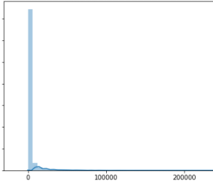
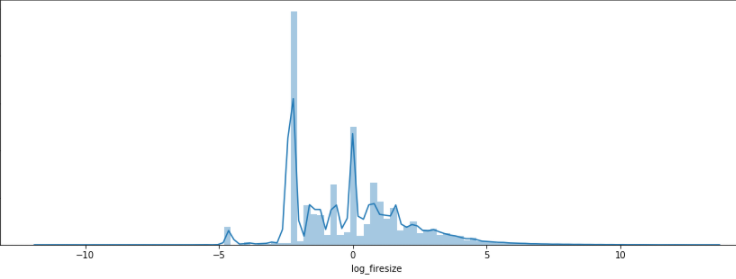
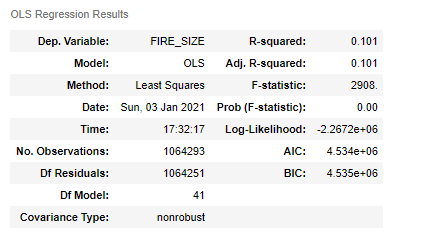
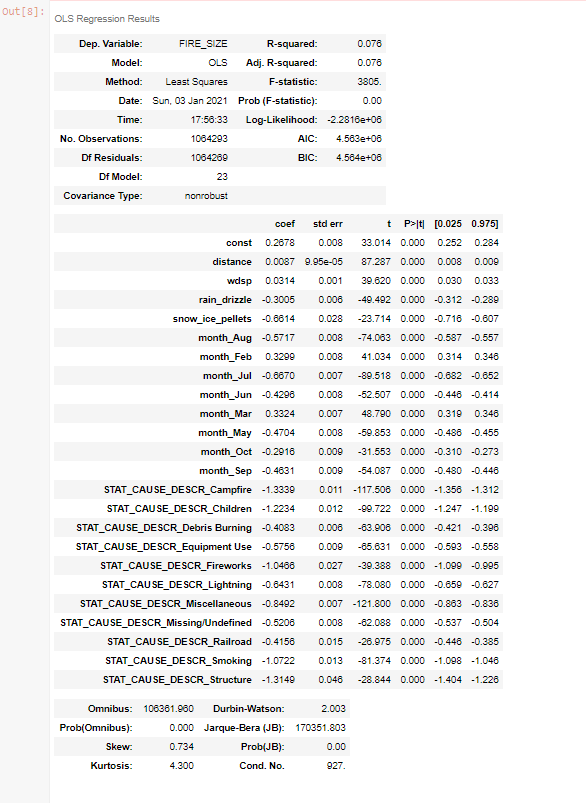
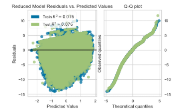

# Prediction of US Forest Fire Severity

Forest fire severity in the United States is a pervasive issue with a potential cost to businesses, individuals, and municipalities of billions of dollars each year. In 2020, CoreLogic estimates that the combined reconstruction cost value of homes at risk in the United States is over 638 billion dollars. Due to the recent availability of each geographically referenced forest fire in the US in [this dataset](https://www.kaggle.com/rtatman/188-million-us-wildfires), it is feasible to search for and uncover the variables that determine the severity of those fire observations. 

In this project, python code is used to demonstrate how large amounts of sparsely related data may be used to infer correlation between certain variables and forest fire size in acres. With recursive addition of new data and refinement, these variables along with others may even be used to predict forest fire severity with reasonable accuracy.  

In a practical sense, the techniques outlined below demonstrate how a data analysis process is used to gather and clean immense volumes of data from seemingly unrelated sources to test a predictive model.

### Part 1: The Data Gathering Process

When contemplating which variables might explain forest fire size, one quickly discovers the intuitive question: Does the weather on the date a fire was observed influence its severity?  Fortunately, vast amounts of historical weather observations around the world are readily available to the public via [this NOAA dataset]( https://www.kaggle.com/noaa/gsod).

To make this data available for download in an efficient way, the National Oceanic and Atmospheric Administration hosts it with the Google Big Query API. With the following code, weather observations between 1992 and 2015 with a station reference table are programmatically queried and downloaded.

``` python
#define station query
query = ('SELECT * FROM bigquery-public-data.noaa_gsod.stations')
#use google big query client to retreive data and create noaa_df dataframe
noaa_df = bqclient.query(query).result().to_dataframe()
noaa_df.to_csv('weatherdata/stations.csv', index = False)

#creates master dataframe with all weather data
for year in tqdm_notebook(range(1992, 2016)):
    query = "SELECT * FROM `bigquery-public-data.noaa_gsod.gsod{}`".format(year)
    df = bqclient.query(query).result().to_dataframe()
    filename = 'weatherdata/US_weather_{}.csv'.format(year)
    df.to_csv(filename, index = False)
```

Next, [1.88 million US forest fire observations]( https://www.kaggle.com/rtatman/188-million-us-wildfires) are easily queried from an SQLite database with Python’s `sqlite3` package.

``` python
#create dataframe by querying Fires table from *.sqlite database
connection = sqlite3.connect('fire_database.sqlite')
firedf = pd.read_sql_query('''SELECT FIRE_YEAR,
                                     DISCOVERY_DOY,
                                     FIRE_SIZE,
                                     LATITUDE,
                                     LONGITUDE,
                                     STAT_CAUSE_DESCR,
                                     STATE
                              FROM Fires''', connection)
```

In both the fire observation dataset and weather station table, there are latitude and longitude reference columns. Reasonably, it is possible to find the nearest weather station to each fire observation, then join the weather event for the date each fire was observed. 

However, one issue that quickly arises is how to calculate each nearest weather station distance. Although it may be easy to write a function that finds the difference in each latitude and longitude coordinates, then finds a distance with a Pythagorean theorem calculation, the earth is round. Therefore, this approach may lead to errors in finding the actual nearest station. In turn, the “Haversine Distance” Formula is used to account for this.


With Python’s `math` package, trigonometric modules easily replicate this equation in the `dist()` function below. Since the `dist()` function simply calculates Haversine distances, it must be nested in another function to find the nearest weather station from all calculations. The `find_nearest()` function does this easily by finding the minimum value calculated in a table column.

``` python
#use Haversine Distance fromula to find distance from fires to stations
from math import radians, cos, sin, asin, sqrt
def dist(lat1, long1, lat2, long2):
    # convert decimal degrees to radians 
    lat1, long1, lat2, long2 = map(radians, [lat1, long1, lat2, long2])
    # haversine formula 
    dlon = long2 - long1 
    dlat = lat2 - lat1 
    a = sin(dlat/2)**2 + cos(lat1) * cos(lat2) * sin(dlon/2)**2
    c = 2 * asin(sqrt(a)) 
    # Radius of earth in kilometers is 6371
    km = 6371* c
    return km

#to match nearest stations to fires
def find_nearest(lat, long):
    distances = weatherwith_stations.apply(
        lambda row: dist(lat, long, row['lat'], row['lon']), 
        axis=1)
    return (weatherwith_stations.loc[distances.idxmin(), 'ref_key'], distances.min())
```

Once the two queries for data gathering and two functions for data joining are established, they are applied to scripts that loop through all the fire observations and weather data between 1992 and 2015. Even with the help of processing parallelization, this takes upwards of eight hours with the following three annotated code notebooks.

[First Notebook: NOAA Weather Data Gathering](https://github.com/Jeff-VA/Sample-Projects/blob/gh-pages/forest_fire_project/Step_1_NOAA_weather_data_gathering_notebook.ipynb)

[Second Notebook: Find Nearest Stations with the Haversine Distance Formula](https://github.com/Jeff-VA/Sample-Projects/blob/gh-pages/forest_fire_project/Step_2_Find_nearest_stations.ipynb)

[Third Notebook: Joining Weather Station Data](https://github.com/Jeff-VA/Sample-Projects/blob/gh-pages/forest_fire_project/Step_3_Join_stations_and_weather_data.ipynb)

Finally, after much preparation, a single table containing most proximate weather data for each of 1.88 million fire observations from between 1992 and 2015 in the United States is created.


### Part 2: The Data Cleaning Process

Even though all the data needed to build a predictive model for forest fire size prediction are readily available in one table, a few preliminary cleaning steps must be addressed.  Below, the cleaning steps are outlined briefly. To see the source code, [this link](‘https://github.com/Jeff-VA/Sample-Projects/blob/gh-pages/forest_fire_project/Step%204%20Data%20Cleaning%20and%20Preparation.ipynb’) navigates to an annotated Jupyter Notebook.

[Fifth Notebook: Analysis](https://github.com/Jeff-VA/Sample-Projects/blob/gh-pages/forest_fire_project/Step%205%20Analysis.ipynb)

First, to effectively interpret these data, an issue of null indicator values is addressed. With close inspection of the unclean table previewed a few lines above, one quickly notices that there are aberrant indicators for missing values in the weather data. For example, for the `dewp` and `slp` variables, `9999.9` represent missing data. In the following code block, these indicator values are all removed, then imputed with a median value for that variable.  The reason medians are imputed, is to account for data skew. Additionally, since the dataset has a fairly large percentage of non-null values, imputation helps retain data for predictive accuracy.

In the output following the code block, the entire `Pandas` data-frame without null counts is previewed to ensure successful imputation. Note that there are 21 variables in the data, including 16 weather variables and the target variable to be predicted: `FIRE_SIZE`. 

``` python
#Replace Null indicators with actual Null values
df['dewp'].replace({9999.9: None}, inplace=True)
df['slp'].replace({9999.9: None}, inplace=True)
df['visib'].replace({999.9: None}, inplace=True)
df['wdsp'].replace({999.9: None}, inplace=True)
df['mxpsd'].replace({999.9: None}, inplace=True)
df['gust'].replace({999.9: None}, inplace=True)
df['max'].replace({9999.9: None}, inplace=True)
df['min'].replace({9999.9: None}, inplace=True)
df['prcp'].replace({99.99: None}, inplace=True)
#create list of null variables
null_vars = ['dewp','slp','visib','wdsp','mxpsd','gust','max','min','prcp']
#ensure datatypes are float for variables with null values
for var in null_vars:
    df[var] = pd.to_numeric(df[var])
    
#loop through null variables and impute medians
for var in null_vars:
    df[var].fillna(df[var].median(), inplace = True)
#ensure success
df.info(null_counts=True)
```


In the next three code blocks, the remaining three data cleaning steps are performed:
>1. Entirely duplicate rows are removed. 
>2. Categorical variables are transformed into a series of binary indicator levels.
>3. All observations that have outliers in continuous variables are repetitively removed until there are none left.

#### 1. Remove Duplicate Rows

``` python
#count rows before duplicates are dropped
obs_before_drop = len(df)
#drop all duplicate rows
df.drop_duplicates(inplace=True)
df.reset_index(drop=True, inplace=True)
#verify number of duplicate observations dropped
print("Total Observations dropped:",(obs_before_drop - len(df)))
```

Total Observations dropped: 6437

#### 2. Convert Categorical Variables to Dummy Levels

``` python
#retain cat_df for univariate analysis of categorical variables
cat_df = df[['month','STAT_CAUSE_DESCR']]
cat_df = cat_df.join(df['FIRE_SIZE'])

#loop through categorical variables and create dummy variables
for var in ['month','STAT_CAUSE_DESCR']:
    dummies = pd.get_dummies(df[var], drop_first=True)
    #rename each dummy variable to include original column title
    for col in dummies:
        dummies.rename(columns={col:'{}_{}'.format(var,col)}, inplace=True)
    #join each dummy dataframe to original table
    df = df.join(dummies)
    #drop categorical variable from original dataframe
    df.drop(columns=var, inplace=True)

#ensure all variables in the dataframe are of a numeric datatype
for var in df.columns:
    df[var] = pd.to_numeric(df[var])
```

#### 3. Outlier Removal

``` python
#remove prcp for outlier consideration since it is so highly skewed
if 'prcp' in cont_vars:
    cont_vars.remove('prcp')
#calulate z-scores for all remoaining continuous variables
z_score = stats.zscore(df[cont_vars])
#define number of observations with high z-scores
obs_to_remove = len(df) - len(df[(z_score < 3).all(axis=1)])
#remove observations with high z-scores
df = df[(z_score < 3).all(axis=1)]
obs_removed = obs_to_remove

#use while loop to recursively remove remaining outliers
while (obs_to_remove > 0):
    #calulate z-scores for all remoaining continuous variables
    z_score = stats.zscore(df[cont_vars])
    #define number of observations with high z-scores
    obs_to_remove = len(df) - len(df[(z_score < 3).all(axis=1)])
    #remove observations with high z-scores
    df = df[(z_score < 3).all(axis=1)]
    #add up observations removed
    obs_removed += obs_to_remove
#print number of observations removed
print('Obervations removed: {}'.format(obs_removed)) 
```

Finally, a clean dataset containing only fire observation size in acres and prepared numeric input variables including weather data is ready for multiple linear regression analysis. 


### Part 3: Analysis

When attempting to build a multiple linear regression model that explains variance in forest fire size, one hurtle quickly arises. A linear regression model fails to explain variance in fire size due to an abnormally right skewed distribution.  



This issue is overcome slightly by logarithmically transforming fire size in acres target variable prior to building a multiple linear regression model.



Although the distribution of fire size is not completely normal after transformation, an initial multiple regression model that explains a significantly higher percentage of variance in fire size is create with an r-squared statistic of approximately 0.1 in with the code below:

``` python
#create multiple regression model log transformed with all predictor variables 
Xc = sm.add_constant(x_train)
linear_regression = sm.OLS(np.log(y_train),Xc)
full_fitted_model = linear_regression.fit()
#summarize model with log transformation:
full_fitted_model.summary()
```

Output:



This full model explains an insignificant portion of fire size in acres for prediction, but perhaps there are certain redundant variables that lead to instability.  Maybe, the prediction accuracy will even increase with the reduction of redundant and multicollinear variables. Subsequently, two code blocks are used to programmatically reduce variable complexity.

This first code block repetitively removes variables with a variance inflation factor or “VIF” of greater than 10.  If an input variable’s VIF is unreasonably high, it might be inferred that the variable is redundant in a multiple linear regression model. In total, nine variables are removed from the model.

``` python
#create VIF data frame and assign variable names to `Feature` column
vif_data = pd.DataFrame() 
vif_data['feature'] = x.columns
#find VIF for each feature and assign to `VIF` column
vif_data['VIF'] = [variance_inflation_factor(x.values, i) 
                   for i in tqdm(range(len(x.columns)))]
#assign variable with the maximum df to the `col` variable
col = vif_data[vif_data['VIF'] == vif_data['VIF'].max()]['feature'].values[0]
#assign max vif to the `vif` variable
vif = vif_data['VIF'].max()
#drop the variable only if the vif is greater than 10
if vif > 10:
    x.drop(columns=col, inplace=True)
#print the name of the variable that was dropped
print('variable dropped: {}'.format(col),'\nVIF: {}'.format(vif))

#loop through remaining predictor variables and drop each with a VIF higher than 10
#begin while loop
while vif_data['VIF'].max() > 10:
    #create VIF data frame and assign variable names to `Feature` column
    vif_data = pd.DataFrame() 
    vif_data['feature'] = x.columns
    #find VIF for each feature and assign to `VIF` column
    vif_data['VIF'] = [variance_inflation_factor(x.values, i) 
                       for i in tqdm(range(len(x.columns)))]
    #assign variable with the maximum df to the `col` variable
    col = vif_data[vif_data['VIF'] == vif_data['VIF'].max()]['feature'].values[0]
    #assign max vif to the `vif` variable
    vif = vif_data['VIF'].max()
    #drop the variable only if the vif is greater than 10
    if vif > 10:
        x.drop(columns=col, inplace=True)
        #print the name of the variable that was dropped
        print('variable dropped: {}'.format(col),'\nVIF: {}'.format(vif))
#trim df variables based of VIF results
cols = list(x.columns.values) + ['FIRE_SIZE']
df = df[cols]
```

In this second code block, each remaining variable is inspected for its contribution to the adjusted r-squared statistic.  If a variable has an unreasonably low or even negative r-squared statistic, it is excluded from the reduced model.

``` python
#variable reduction by Adjusted R2
#adjusted R2 function definition
def adj_rsquared(x_train, y_train, x_test):
    '''
    This function predicts the R2 statistic for a training data set predicitons compared
    to a test dataset.  The R2 Statistic is then adjusted for the number of input variables in 
    the model by the formula `1-(1-r2)*(n-1)/(n-p-1)` where n is the number of observations and 
    p is the number of independent variables (levels)  
    
    The single output variable is the adjusted R squared statistic
    '''
    reg = LinearRegression()
    y_pred = reg.fit(x_train, np.log(y_train)).predict(x_test)
    r2 = r2_score(np.log(y_test),y_pred)
    n = len(x_test)
    p = len(x_test.columns)
    adj_r2 = 1-(1-r2)*(n-1)/(n-p-1)
    return adj_r2

#Loop through all predictor variables and find adjusted r2 contributions for each variable
#create statistic dataframe
r2_per_var = pd.DataFrame()
#loop through all vars in training dataset
for var in tqdm(x_train.columns):
    #create subset of vars not including variable in question
    selection = [i for i in x_train.columns if i!=var]
    #subtract adjusted R2 from model without variable
    diff = adj_rsquared(x_train, y_train, x_test) - adj_rsquared(x_train[selection], y_train, x_test[selection])
    #create temp dataframe of resulting variable and value
    temp_df = pd.DataFrame({"Variable":[var],
                          "R2 Contribution":[diff]})
    #append all resulting values to `r2_per_var` dataframe
    r2_per_var = r2_per_var.append(temp_df)
#format resulting dataframe
r2_per_var["R2 Contribution"] = r2_per_var["R2 Contribution"].apply('{0:.9f}'.format)
r2_per_var.reset_index(inplace=True, drop=True)
r2_per_var['R2 Contribution'] = r2_per_var['R2 Contribution'].astype('float')
#create percent contribution column
r2_per_var["R2 Percent"] = r2_per_var["R2 Contribution"]/r2_per_var["R2 Contribution"].sum()
```

Finally, from the code below, a reduced model is fit to explain variance in fire size. Unfortunately, the explained variance is still insignificantly low with an r-squared statistic of 0.076.

``` python
#sumarize reduced model
Xc = sm.add_constant(x_train)
linear_regression = sm.OLS(np.log(y_train),Xc)
reduced_fitted_model = linear_regression.fit()
reduced_fitted_model.summary()
```
Output:



### Results
Although this model fails to predict fire size in acres as previewed in the predicted value residual plot generated below, some insight of value is gained. Specifically, the variable reduction performed in the previous few code blocks did uncover certain weather variables that have a statistically significant correlation with the logarithmic transformation of fire size in acres. It may be reasonably inferred that the following weather observation variables contribute to fire severity on a daily basis:
* `wdsp` (The average windspeed on the date of fire observation)
* `rain_drizzle` (Whether there was rain on the date of the fire observation)
* `snow_ice_pellets` (Whether there were snow or ice pellets on the date of the fire observation)



